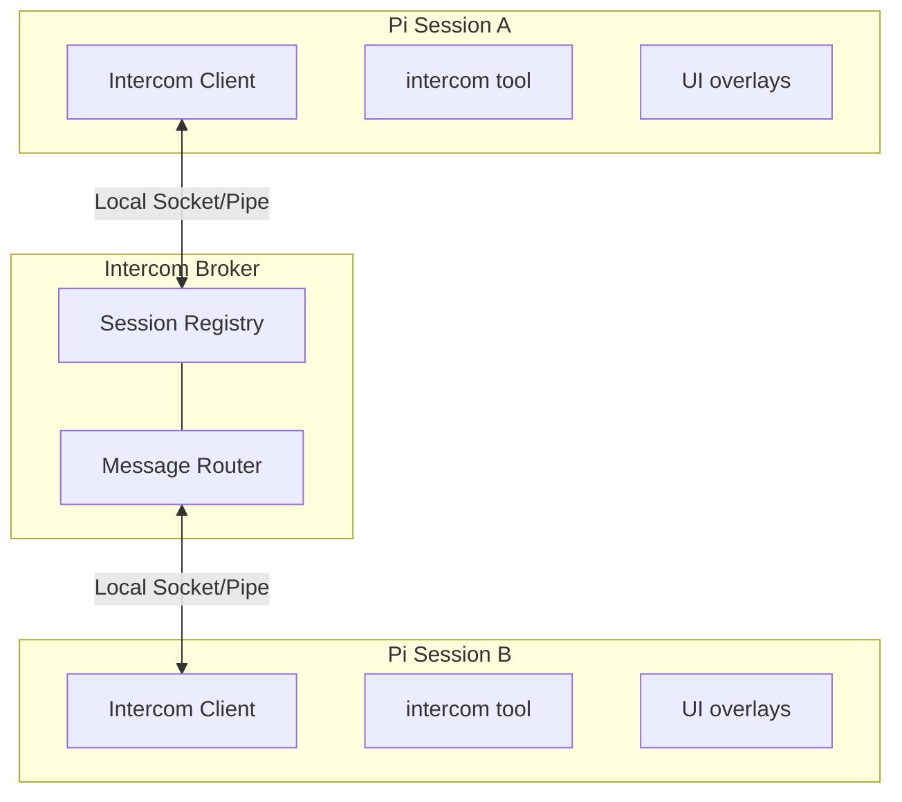

<p>
  
</p>

# Pi Intercom

Targeted messaging between pi sessions on the same machine. Send context, findings, or requests to one session or a deliberate group — whether you're driving the conversation or letting agents coordinate.

```text
User flow: press Alt+M or run /intercom to pick a session and send a message
```

## Why

Sometimes you're running multiple pi sessions — one researching, one executing, one reviewing. Pi-intercom lets you:

- **User-driven orchestration** — Send context or findings from your research session to your execution session
- **Agent collaboration** — An agent can reach out to another session when it needs help or wants to share results
- **Session awareness** — See what other pi sessions are running, their concise current focus, and live status

Unlike pi-messenger (a shared chat room for multi-agent swarms), pi-intercom is optimized for targeted communication where you pick the recipients. It can send one message independently to several explicit sessions and has a deliberately discouraged machine-wide broadcast for the rare notice that genuinely concerns every visible live peer.

Pi-intercom also integrates well with [pi-subagents](https://github.com/nicobailon/pi-subagents): delegated child agents get a child-only `contact_supervisor` tool when `pi-subagents` supplies bridge metadata. Use `reason: "need_decision"` for blocking clarification, `reason: "interview_request"` for multiple structured supervisor answers, and `reason: "progress_update"` for meaningful plan-changing updates. Normal sessions only see the regular `intercom` tool.

## In One Minute

Each pi session that has `pi-intercom` loaded and enabled connects to a tiny local broker over a local IPC transport. The broker keeps track of connected sessions and routes an independent direct message to each session you target by name or session ID. The extension gives you both a tool (`intercom`) and a small overlay UI (`/intercom` or `Alt+M`). Incoming messages are rendered inline inside the recipient session, can trigger a turn immediately by default, and are also stored in Pi session history as extension entries. If you want a stricter local trust posture, `inboundTrigger` can reduce or disable auto-triggering.

## Install this ACL fork

If upstream `pi-intercom` is already installed, remove it first so Pi does not load both copies. Then install this fork at the pinned release:

```bash
pi remove npm:pi-intercom
pi install git:github.com/Scott-Meyer/pi-intercom-subagent-acl@v0.13.0-acl.8
```

For a fresh install, only the second command is needed. Then restart Pi. The extension auto-connects to the broker on startup and registers the bundled `pi-intercom` skill for common coordination patterns.

### Pi compatibility

This package supports both Pi distributions:

- `@mariozechner/pi-coding-agent` 0.73.1
- `@earendil-works/pi-coding-agent` 0.80.3 or newer with a compatible sibling-package set; 0.80.3 is tested with `pi-agent-core`, `pi-ai`, and `pi-tui` pinned to 0.80.3, while the current 0.85.1 release is tested with its default resolution

Installing pi-intercom does not install or replace either coding-agent distribution or duplicate its host libraries. Pi, TUI, and TypeBox are optional peers supplied by the host; the package's only hard runtime dependency is `tsx`, used by the standalone broker. The fork loader maps the upstream-compatible extension imports to its own host modules. Fork hosts publish name changes to extensions immediately; upstream 0.73.1 exposes the same core event only to RPC/TUI consumers, so pi-intercom uses a one-second compatibility fallback there. `npm run test:host-compat` packs the extension and boots it under upstream 0.73.1, a coherent fork 0.80.3 dependency set, and fork 0.85.1 without allowing one coding-agent distribution to pull in the other.

The ACL additions are also optional at runtime. An ordinary Pi session without pi-subagents bridge metadata gets normal intercom behavior. Child-only visibility and the fallback `contact_supervisor` tool activate only when pi-subagents provides the corresponding environment metadata; if its native supervisor channel is available, pi-intercom leaves that tool to the native channel.

**Recommended:** Add this snippet to your project's `AGENTS.md` to help agents understand when to coordinate across sessions:

```xml
<pi-intercom>
Coordinate with other local pi sessions on related codebases. Use `/skill:pi-intercom` for patterns.

**When:** Same codebase (parallel work), reference codebase (consulting patterns), related repos (shared libraries). For substantial work that may overlap or benefit from a nearby perspective, consider listing peers early.

**Not when:** Unrelated codebases, trivial questions, or when you can proceed independently.

**Principle:** Prefer `send` for notifications; `ask` only when blocked waiting for input.
</pi-intercom>
```

A session becomes intercom-connected when all of these are true:
- the `pi-intercom` extension is installed and loaded in that session
- `enabled` is not set to `false` in the intercom config file, which defaults to `~/.pi/agent/intercom/config.json`
- the session has started or reloaded after the extension was installed
- the local broker is running or can be auto-started

The session list only shows intercom-connected sessions, not every open Pi process on the machine.

If a session is unnamed, pi-intercom exposes a collision-resistant runtime-only fallback alias like `session-1a2b3c4d-5e6f-7a8b` so other connected sessions can target it. That alias is not persisted as the Pi session title or treated as a reconnect identity, so `pi --resume` can keep showing the transcript snippet without allowing a different unnamed process to inherit queued mail.

### Name your current session

Use `/alias <name>` as a pi-intercom-friendly way to name the current session:

```text
/alias api-worker
```

The alias is Pi's session name, so it is persisted in the session and immediately
published to pi-intercom peers. Session lists, send/reply results, overlays, and
incoming message headers use it when available. In an interactive UI, `/alias`
or `/alias menu` opens an input for the current session's alias; it does not
rename other sessions. Use `/alias <name>` in non-UI modes.

An agent may also add `profile: { name?, description? }` to any intercom action.
The description is a 5–9 word current focus shown in lists and overlays; pass
`description: null` to clear it. Each tool result repeats the caller's canonical
Pi name, broker-confirmed intercom name when available, description, and
publication status as lightweight context. A profile name can fill an
unnamed/generated identity and later revise that profile-managed name, but
cannot replace an explicit user or host name.
Descriptions are display metadata only: they never affect routing, ACLs,
mailboxes, or session continuity.

## Quick Start

### From the Keyboard

Press **Alt+M** or type `/intercom` to open the session list overlay:

1. **Select a session** — Use arrow keys to pick a target session
2. **Compose message** — Write your message in the compose overlay
3. **Send** — Press Enter to send, Escape to cancel

### From the Agent

The agent can list sessions and send messages using the `intercom` tool. Tool calls and results render as compact transcript rows so send/ask/reply flows are easy to scan. Use `/intercom-id` to insert a handoff snippet for the current session's stable intercom target into the editor. For common patterns like planner-worker delegation, the bundled `pi-intercom` skill provides copy-paste ready examples:

```typescript
// List active sessions and publish a short focus in the same call
intercom({
  action: "list",
  profile: { description: "Implementing local API validation and retries" }
})
// → **Current session:**
// → • executor (20d43841) — Implementing local API validation and retries — ~/projects/api (claude-sonnet-4 · 42% ctx) [self, idle]
// → **Other sessions:**
// → • research (6332faab) — Reviewing authentication edge cases and tests — ~/projects/api (claude-sonnet-4) [same cwd, thinking]
// → Self profile: executor — Implementing local API validation and retries

// List only peers in the same working directory
intercom({ action: "list-cwd" })

// Send a message
intercom({ action: "send", to: "research", message: "Check if UserService.validate() handles null" })
// → Message sent to research

// Send independently to a deliberate set of peers
intercom({
  action: "send",
  targets: ["api-worker", "ui-worker"],
  message: "The shared contract changed; pull the latest types before continuing."
})
// → Message accepted for 2 of 2 targets.

// Send to a visible peer session in another codebase, opening a Herdr project pane if needed
intercom({
  action: "send",
  cwd: "/Users/me/projects/billing",
  openProjectPaneIfMissing: true,
  message: "Let's discuss the billing retry design in this repo."
})
// → Opened Herdr project pane pane-... for /Users/me/projects/billing and sent message to session-...

// Check connection status
intercom({ action: "status" })
// → Connected: Yes, Session ID: abc123, Active sessions: 3

// Send with attachments (code snippets, files, or context)
intercom({
  action: "send",
  to: "worker",
  message: "Here's the fix:",
  attachments: [{
    type: "snippet",
    name: "auth.ts",
    language: "typescript",
    content: "function validate(user: User) { ... }"
  }]
})
```

### Receiving Messages

When a message arrives, it appears inline in your chat with the sender's info and a reply hint:

```
**From research** (~/projects/api)

To reply, use the intercom tool: intercom({ action: "reply", message: "..." })

Found the issue — UserService.validate() doesn't check for null input.
See auth.ts:142-156.
```

The reply hint (enabled by default) points to `intercom({ action: "reply", ... })`, so recipients do not need raw sender or `replyTo` IDs. Idle recipients get a new turn immediately; busy interactive recipients receive the message through Pi's steering queue at the next safe model boundary without aborting the active turn. Attachment content is included in the agent-visible body, and messages are rendered inline and stored in Pi session history.

## Workflow: Planner-Worker Coordination

The most natural use of pi-intercom is splitting a task between two sessions — one holds the big picture, the other does the hands-on work. When the worker hits an ambiguity ("should I optimize for readability or performance here?"), they ask without losing context.

### Setup

Open two terminals and start pi in each. Name them so they can find each other:

```
# Terminal 1                    # Terminal 2
/alias planner                 /alias worker
```

Verify they see each other from either session:

```typescript
intercom({ action: "list" })
// → • worker — ~/projects/api (claude-sonnet-4) [idle]
```

### The Conversation

Here's how a typical exchange looks. The planner delegates with `send` (fire-and-forget). The worker uses `ask` for anything that needs a response — questions, discoveries, completion reports. `ask` sends the message and blocks until the planner replies, so the worker gets the answer as a tool result and continues in the same turn.

**Planner sends a task:**
```typescript
intercom({
  action: "send",
  to: "worker",
  message: "Task-3: Add retry logic to API client. Key files: src/api/client.ts, src/api/types.ts. Ask if anything's unclear."
})
```

**Worker hits an ambiguity — asks and waits:**
```typescript
intercom({
  action: "ask",
  to: "planner",
  message: "Should retry apply to all endpoints or just idempotent ones? Also, max retry count and backoff strategy?"
})
// → Reply from planner: Only GET/PUT/DELETE — never POST. Max 3 retries, exponential backoff starting at 100ms.
// Worker continues implementing with the answer, same turn, full context.
```

**Worker finds something unexpected — escalates and waits:**
```typescript
intercom({
  action: "ask",
  to: "planner",
  message: "Found: fetchWithTimeout swallows network errors. Fixing this changes the error shape. OK to proceed?"
})
// → Reply from planner: Yes, surface the error types. The current behavior is a bug.
```

**Worker reports completion:**
```typescript
intercom({
  action: "ask",
  to: "planner",
  message: "Task-3 done. Added RetryPolicy type, applied to GET/PUT/DELETE, surfaced NetworkError, 4 tests passing."
})
// → Reply from planner: Looks good. Move on to task-4.
```

### Communication Patterns

| Pattern | Action | Why |
|---------|--------|-----|
| **Task Delegation** | Planner uses `send` | Fire-and-forget. Planner doesn't need to wait for an ack. |
| **Clarification Request** | Worker uses `ask` | Worker needs the answer to proceed. Blocks until reply. |
| **Discovery Escalation** | Worker uses `ask` | Worker needs approval before changing course. |
| **Completion Report** | Worker uses `ask` | Planner might have follow-up instructions or the next task. |

### Reply Hints

When `replyHint` is enabled (the default), incoming messages include the exact `intercom()` call to respond:

```
**From planner** (~/projects/api)

To reply, use the intercom tool: intercom({ action: "reply", message: "..." })

Only GET/PUT/DELETE — never POST. Max 3 retries with exponential backoff starting at 100ms.
```

This matters because the agent receiving the message doesn't need to reconstruct raw `to` and `replyTo` IDs — the hint is right there. Combined with immediate idle triggering and safe busy-turn steering, it enables real back-and-forth conversation without aborting work in progress or delaying messages until they become stale. If the reply happens later instead of in the triggered turn, `intercom({ action: "reply" })` falls back to the single unresolved inbound ask, and `intercom({ action: "pending" })` shows who is still waiting.

### `send` vs `ask`

`send` is fire-and-forget — the tool returns immediately after delivery. When the destination has exactly one pending inbound ask, `send` infers that it is the answer, attaches the ask's `replyTo`, and reports `Reply sent to <target> (inferred from pending ask)`. During a turn triggered by an inbound ask, `send` refuses a different non-reply target instead of treating CWD, roster position, or project hierarchy as reply authority. With zero or multiple matching asks, it remains an ordinary unthreaded send. An inferred answer still uses the `confirmSend` dialog when configured; only a caller-supplied `replyTo` skips confirmation.

`ask` requires a currently connected recipient, then blocks until it responds (10-minute timeout by default; set `PI_INTERCOM_ASK_TIMEOUT_MS` to a positive millisecond value to change it). If the target is disconnected, `ask` fails immediately; use `send` when queued, non-blocking mailbox delivery is appropriate. The reply comes back as the tool result, so the agent continues in the same turn with full context. No confirmation dialog — if you're asking and waiting, the intent is clear.

`reply` is receiver-side sugar for replying to an inbound ask. In the turn triggered by an incoming intercom ask, `intercom({ action: "reply", message: "..." })` targets that exact sender and message automatically. If you reply later, it falls back to the single unresolved inbound ask. If multiple asks are pending, use `intercom({ action: "pending" })` to inspect them and then call `reply` with `to` to disambiguate.

The broker keeps a bounded in-memory mailbox for recently disconnected explicitly named sessions. If a lightweight CLI sender asks a long-running session something and exits before the answer, the later `reply` is accepted into that mailbox instead of failing with `Session not found`; a process that reconnects with the same explicit name and directory receives the queued reply. Runtime-only unnamed-session aliases never transfer mailbox ownership, and routing never remaps mail back to its sender. This is per-broker runtime state, not durable storage across broker restarts.

Incoming messages carry diagnostic metadata end to end: stable message ID, sender sequence, sender timestamp, broker receive/delivery timestamps, receiver receive timestamp, and injection timestamp. Connected interactive receivers emit `receiver_received`, `acknowledged`, and `injected` as they hand messages to Pi; duplicate IDs are acknowledged but injected at most once per receiving session. Broker mailbox delivery for temporarily disconnected targets can still report queued delivery. If an `ask` times out, the timeout names the message ID and last known delivery state. Timeout is not cancellation: an injected or broker-queued message may remain actionable unless an explicit cancellation path says otherwise.

Cancellation is explicit: call `intercom({ action: "cancel", messageId })` to request cancellation of a message you originally sent. Connected interactive messages are injected immediately, so the receiver normally reports `cancellation_requested` rather than pretending it removed work from a private queue. Supersede is also explicit: pass `supersedes: "old-message-id"` on a new `send` or `ask`. The broker only allows same sender → same receiver supersedes, marks the old message `superseded`, and sends the replacement with a new ID; an already-steered old message may still be processed. Retries are never automatic; a retry should be a new authored message, optionally linked with `retryOf`.

The planner typically uses `send`. If you prefer manual approval for outgoing non-reply messages, turn on `confirmSend: true`. The worker uses `ask` for everything (no confirmation needed, gets answers inline), so it can operate autonomously either way.

## Workflow: Subagent-to-Supervisor Escalation

This workflow requires [`pi-subagents`](https://github.com/nicobailon/pi-subagents) to be installed and to supply child bridge metadata. When `pi-subagents` spawns a delegated child with that metadata, the child session gets a subagent-only `contact_supervisor` tool in addition to the regular `intercom` tool. Normal sessions never see `contact_supervisor`.

### When the Tool Appears

`contact_supervisor` only registers when `pi-subagents` sets all of these environment variables:

- `PI_SUBAGENT_ORCHESTRATOR_TARGET` — the supervisor session name or ID
- `PI_SUBAGENT_RUN_ID` — the run identifier
- `PI_SUBAGENT_CHILD_AGENT` — the agent type
- `PI_SUBAGENT_CHILD_INDEX` — the child index within the run

If any are missing, the session falls back to the regular `intercom` tool.

### Three Reasons

| Reason | Behavior | Use When |
|--------|----------|----------|
| `need_decision` | Sends an ask and blocks until the supervisor replies (10-minute timeout by default; configurable with `PI_INTERCOM_ASK_TIMEOUT_MS`) | The subagent is blocked, uncertain, needs approval, or faces a product/API/scope decision |
| `interview_request` | Sends structured questions and blocks until the supervisor replies | The subagent needs multiple machine-readable answers from the supervisor in one exchange |
| `progress_update` | Fire-and-forget update to the supervisor | Meaningful progress or unexpected discoveries that change the plan |

Do not use `contact_supervisor` for routine completion handoffs. Return the final subagent result normally through `pi-subagents`.

A child subagent can still use the regular `intercom` tool to coordinate with an explicit peer session. Use `to` alone for any live peer on the machine, `cwd` alone for the sole live peer in another codebase, or `to` plus `cwd` when the directory is a safety guard. Use `contact_supervisor` instead when the answer changes the task contract, needs owner approval, or would require opening a new visible project pane.

For bounded work in another codebase, prefer `pi-subagents` with an explicit `cwd`. Intercom project panes are for durable visible peer conversations, not ordinary delegated work.

### Example: Blocked Subagent Asks for Guidance

```typescript
contact_supervisor({
  reason: "need_decision",
  message: "The auth service returns 403 instead of 401 for expired tokens. Should I treat 403 as a re-auth trigger or a hard failure?"
})
// → Reply from supervisor: Treat 403 as re-auth trigger. Update the token refresh logic.
```

### Example: Structured Supervisor Interview

```typescript
contact_supervisor({
  reason: "interview_request",
  message: "Please answer these before I continue the migration.",
  interview: {
    title: "API migration choices",
    questions: [
      { id: "api", type: "single", question: "Which API should I target?", options: ["Stable API", "Experimental API"] },
      { id: "constraints", type: "text", question: "What constraints should I preserve?" }
    ]
  }
})
// → Reply from supervisor: { "responses": [{ "id": "api", "value": "Stable API" }, ...] }
```

### Example: Progress Update

```typescript
contact_supervisor({
  reason: "progress_update",
  message: "Discovered the bug is in the retry wrapper, not the API client. Fixing the wrapper will also close issue #42."
})
// → Progress update sent to supervisor planner
```

### What the Supervisor Sees

The supervisor receives a formatted message with run metadata:

```
**From subagent-worker-78f659a3-1**

Subagent needs a supervisor decision.
Run: 78f659a3
Agent: worker
Child index: 0

Which API should I use?
```

Reply hints work the same as regular `intercom` ask/reply flows. The supervisor can reply with `intercom({ action: "reply", message: "..." })` and the subagent receives the answer as the tool result.

For `interview_request`, the supervisor message includes the structured questions plus a fenced JSON answer example using this stable shape:

```json
{
  "responses": [
    { "id": "api", "value": "Stable API" },
    { "id": "constraints", "value": "Keep the public error shape unchanged." }
  ]
}
```

The supervisor can reply with plain JSON or a fenced `json` block. If the reply matches the `{ "responses": [...] }` shape and references valid question ids/options, the child tool result includes it in `details.structuredReply` while still showing the raw reply text.

## Tool Reference

### intercom

| Parameter | Type | Description |
|-----------|------|-------------|
| `action` | string | `"list"`, `"list-cwd"`, `"send"`, `"broadcast"`, `"ask"`, `"reply"`, `"pending"`, `"status"`, `"cancel"`, or `"advertise"` |
| `to` | string | One target session name or ID. Without `cwd`, send/ask resolve it globally. With `cwd`, send/ask require the target to be in that directory. Also disambiguates reply. |
| `targets` | string[] | For `send`, 1–32 explicit session names or IDs. Each recipient gets an independent message and delivery outcome. Cannot be combined with `to`, cwd targeting, or conversation-specific reply/retry/supersede fields. |
| `message` | string | Message text (for send/broadcast/ask/reply) |
| `attachments` | array | Optional `file`, `snippet`, or `context` attachments |
| `replyTo` | string | Optional message ID for threading or replying to an `ask` |
| `messageId` | string | Message ID to cancel; required by `cancel` and rejected by every other action |
| `supersedes` | string | Optional previous message ID that this send/ask explicitly replaces |
| `retryOf` | string | Optional previous message ID that this send/ask explicitly retries |
| `cwd` | string | Working directory filter for `list-cwd`. For send/ask, scopes target lookup to that directory; without `to`, selects the sole live peer there. |
| `openProjectPaneIfMissing` | boolean | For `send`/`ask` with `cwd`, open a visible Herdr project pane and launch Pi when no matching live session exists |
| `focus` | boolean | For `openProjectPaneIfMissing`, focus the new Herdr pane. Defaults to true |

### contact_supervisor

Only registered in sessions where `pi-subagents` supplied the required child bridge metadata. Contacts the supervisor session that delegated the current task.

| Parameter | Type | Description |
|-----------|------|-------------|
| `reason` | string | `"need_decision"` (blocking), `"interview_request"` (blocking structured questions), or `"progress_update"` (fire-and-forget) |
| `message` | string | The decision request, optional interview note, or progress update |
| `interview` | object | Required for `interview_request`: `{ title?, description?, questions: [...] }` |

**`need_decision`** — Sends a formatted ask to the supervisor and blocks until it replies (10-minute timeout by default; configurable with `PI_INTERCOM_ASK_TIMEOUT_MS`). The reply comes back as the tool result. Includes run metadata in the message so the supervisor knows which subagent is asking.

**`interview_request`** — Sends a formatted, agent-readable interview to the supervisor and blocks until it replies. Questions use a local pi-interview-like shape: `{ id, type, question, options?, context? }` where `type` is `single`, `multi`, `text`, `image`, or `info`. `info` questions are context-only and do not need responses. The supervisor reply should be JSON with `{ "responses": [{ "id": "...", "value": ... }] }`. Parsed JSON replies are returned in `details.structuredReply`.

**`progress_update`** — Sends a non-blocking update to the supervisor. Returns immediately after delivery. Use only for meaningful progress or unexpected discoveries that change the plan.

### intercom actions

**`list`** — Returns the current session plus other active intercom-connected sessions with name, short ID, working directory, model, and live status. Status is derived automatically from Pi lifecycle events: `idle`, `thinking`, `tool:<name>`, or, on supported hosts, `compacting`. Compaction status is passive presence—it does not wake or steer peer agents.

**`send`** — Sends a message to one session with `to`, or independently to 1–32 explicit sessions with `targets`. Every multi-target recipient gets a distinct message ID, delivery record, receipt route, and outcome; aliases that resolve to the same live session are delivered only once, and one failure does not roll back successful recipients. Multi-target sends are intentionally unthreaded, so they reject `replyTo`, `supersedes`, and `retryOf`. Singular sends retain reply inference: if the destination has exactly one pending inbound ask, `send` infers the message is its answer and returns `Reply sent to <target> (inferred from pending ask)`. During a turn triggered by an inbound ask, a non-reply send to a different target—and every batch send—is rejected so the answer cannot be misdirected. Set `confirmSend: true` to confirm ordinary sends once before delivery; multi-target confirmation displays and pins the resolved endpoint snapshot so an alias cannot rebind to a different recipient after approval. `to` alone resolves globally across all live sessions. `cwd` alone targets the sole live peer in that directory. `to` plus `cwd` requires that peer to be in the directory. With `openProjectPaneIfMissing: true`, pi-intercom opens a visible Herdr project pane, starts Pi there, waits for that session to register, then delivers the message through normal intercom routing.

**`broadcast`** — Sends independent messages to every currently connected session visible through the caller's existing scope and subagent ACL, excluding the sender. The recipient set is a live roster snapshot; disconnected sessions are not queued, and sessions joining afterward are not included. Broadcast interrupts every recipient, so prefer `send` with `to` or `targets` whenever you know who needs the information. Broadcast rejects targeting and conversation-specific fields.

**`ask`** — Requires a currently connected recipient, sends a message, and waits for the recipient to reply (10-minute timeout by default; configurable with `PI_INTERCOM_ASK_TIMEOUT_MS`). A disconnected target fails immediately rather than queueing a blocking request. The reply is returned as the tool result. No confirmation dialog. Only one pending `ask` is allowed per session at a time. Use this when the agent needs the answer to continue working. The same `to`, `cwd`, and `openProjectPaneIfMissing` targeting rules apply.

**`reply`** — Replies to the current intercom-triggered message if there is one. Otherwise it falls back to the single unresolved inbound ask. If multiple asks are pending, pass `to` or inspect them with `pending` first. Under the hood this is still a normal `send` with the exact `replyTo` value.

**`pending`** — Lists unresolved inbound asks with sender, message ID, elapsed time, and a short preview. Useful when replying after the original triggered turn.

**`cancel`** — Requests cancellation of a message previously sent by the current session. Queued messages are removed before injection; already-injected messages receive a visible cancellation request.

**`status`** — Shows connection status, session ID, and total count of active sessions (including the current session).

### Just-in-time compaction awareness

Successful compactions advance a private broker-owned generation for the session's stable intercom ID. At the next accepted direct contact, `send`, `ask`, `reply`, the compose overlay, and each explicit multicast outcome say when that peer compacted since the previous direct contact. Incoming direct messages carry the same notice in the message already being delivered. When a peer is live and current context usage is known, the notice includes it so references can be made explicit before relying on older conversational detail; queued contact never describes a disconnected presence snapshot as current.

The first contact between two identities establishes a synchronously durable baseline without making a historical claim. Directional contact watermarks and compaction generations persist across reconnects and broker restarts; detection compares generations rather than elapsed time, so machine sleep and clock changes do not create false positives. Broker state files, limits, and recovery are isolated per scope; those files hash scopes, stable session IDs, and compaction event IDs rather than storing routing identities in plaintext. The Pi session journal retains opaque pending event IDs so compaction reports can be retried until the broker acknowledges durable storage.

Compaction itself never sends a message or wakes another session. Broadcast neither displays nor consumes compaction notices and never enters the collaboration graph. A send rejected before acceptance does not advance contact watermarks. Sender first-contact baselines are durable before delivery success; receiver baselines are durably staged before delivery and promoted only after the surfaced message's opaque token is acknowledged. The Pi session journal retries an unconfirmed receiver token across reconnects and broker restarts. Later compaction notices also remain pending until acknowledgement and may safely repeat rather than be lost. Older clients do not advertise the capability, so mixed-version contact cannot silently consume a notice.

## Keyboard Shortcuts

| Key | Action |
|-----|--------|
| Alt+M | Open session list overlay |
| ↑/↓ | Navigate session list |
| Enter | Select session / Send message |
| Escape | Cancel / Close overlay |

## Config

Create `~/.pi/agent/intercom/config.json`:

```json
{
  "brokerCommand": "npx",
  "brokerArgs": ["--no-install", "tsx"],
  "confirmSend": false,
  "inboundTrigger": "always",
  "enabled": true,
  "replyHint": true,
  "status": "researching"
}
```

| Setting | Default | Description |
|---------|---------|-------------|
| `brokerCommand` | `"npx"` | Advanced trusted override for the broker executable. The default value is hardened internally to launch the resolved bundled `tsx` CLI through the current Node executable instead of resolving `npx` through `PATH`. |
| `brokerArgs` | `["--no-install", "tsx"]` | Advanced trusted arguments passed to custom `brokerCommand` before the broker script path |
| `confirmSend` | false | Show a confirmation dialog before ordinary or inferred sends from an interactive session with UI; caller-supplied `replyTo` skips it |
| `inboundTrigger` | `"always"` | Auto-trigger policy for inbound broker messages: `"always"`, `"replies"`, or `"never"`. Local in-process subagent relay events still trigger the addressed session. |
| `enabled` | true | Enable/disable intercom entirely |
| `replyHint` | true | Include reply instruction in incoming messages |
| `status` | — | Optional custom status suffix shown after the automatic lifecycle status, for example `thinking · researching` |

If `config.json` cannot be parsed or contains an invalid value, pi-intercom logs the error and fails closed for inbound broker auto-triggering by using `inboundTrigger: "never"` until the config is fixed.
Obsolete `toolVisibility` values are ignored; the generic `intercom` tool remains stable in the active tool set for prompt-cache friendliness.

Custom broker commands are trusted local configuration: anyone who can edit this config can choose the executable used for future broker auto-spawns. For example, if you have Bun installed and want it to start the broker directly, use:

```json
{
  "brokerCommand": "bun",
  "brokerArgs": []
}
```

Pi-intercom publishes live session status automatically. Sessions register as `idle`, switch to `thinking` while the agent is running, and show `tool:<name>` during tool execution. On hosts that report unsuccessful compactions to extensions (Earendil Pi 0.85+), they also publish `compacting` from pre-compaction until success, failure, or abort; the underlying thinking/tool/idle state resumes afterward. Older hosts leave compaction presence disabled rather than risk stale status after an unreported failure. This is passive roster presence and never wakes peer agents. If `status` is set in config, it is appended as context instead of replacing the lifecycle status.

Set `PI_INTERCOM_SCOPE_ID` before starting Pi to opt a session into an opaque broker routing scope. The value is trimmed. Empty values are treated as unscoped. A scoped session can list, address by full ID, name, ID prefix, or cwd, receive presence and session lifecycle events, recover queued mailbox messages, and use extension-channel owner, publish, and state traffic only with sessions that registered the exact same scope. Scoped sessions and unscoped sessions do not cross this boundary. Existing unscoped behavior is unchanged when the variable is not set.

By default, runtime state and config live under `~/.pi/agent/intercom`. If Pi is launched with `PI_CODING_AGENT_DIR`, pi-intercom uses `$PI_CODING_AGENT_DIR/intercom` instead, including `config.json`, broker PID/lock files, sockets, and launcher state.

## Extension channels

Other Pi extensions can use intercom's broker for bounded, non-conversational coordination. Extension-channel traffic never calls `pi.sendMessage()`, never enters a session transcript, and never starts an agent turn.

Register during `session_start` so intercom includes the capability in its deferred broker registration:

```typescript
// Use @earendil-works/pi-coding-agent here when targeting that distribution.
import type { ExtensionAPI } from "@mariozechner/pi-coding-agent";
import {
  INTERCOM_EXTENSION_REGISTER_EVENT,
  type IntercomExtensionChannel,
} from "pi-intercom/extension-api.ts";

export default function (pi: ExtensionAPI) {
  let channel: IntercomExtensionChannel | undefined;

  pi.on("session_start", () => {
    pi.events.emit(INTERCOM_EXTENSION_REGISTER_EVENT, {
      namespace: "example/v1",
      ownerEligible: true,
      onReady: (value: IntercomExtensionChannel) => { channel = value; },
      onEvent: (event: unknown) => { /* owner, state, peer, or payload event */ },
    });
  });
}
```

The broker:

- advertises `extension-bus-v1` through feature negotiation
- routes payloads only to sessions advertising the same namespace
- elects one owner per namespace and changes its epoch after socket replacement
- rejects stale owner-only writes
- stores at most 64 KiB of opaque, revisioned state per namespace

`channel.publish()` accepts payloads up to 16 KiB. A `capable` broadcast includes the sender, so consumers must not blindly republish messages they receive. `channel.commitState()` uses compare-and-swap against the last observed revision. Capabilities registered after the broker connection is established are synchronized without reconnecting. Clients connected to an older broker see the channel as unsupported and do not send extension operations.

### Extension outbox

Same-process extensions can request a user-visible intercom send through the consent-aware outbox. Emit `intercom:outbox-request` with a unique `requestId`; listen for `intercom:outbox-result` and treat `sent`, `rejected`, `blocked`, and `failed` as terminal states. There is no fire-and-forget mode.

```typescript
import {
  INTERCOM_OUTBOX_REQUEST_EVENT,
  INTERCOM_OUTBOX_RESULT_EVENT,
  type IntercomOutboxResult,
} from "pi-intercom/extension-api.ts";

pi.events.on(INTERCOM_OUTBOX_RESULT_EVENT, (result: IntercomOutboxResult) => {
  if (result.requestId === "example-request-1") {
    // Handle the terminal result.
  }
});

pi.events.emit(INTERCOM_OUTBOX_REQUEST_EVENT, {
  version: 1,
  requestId: "example-request-1",
  extensionId: "example-extension",
  extensionName: "Example Extension",
  to: "planner",
  message: "Build finished.",
});
```

`confirmSend` applies to outbox requests. If confirmation is required and no UI is available, the request fails closed with `confirmation_unavailable`. The outbox resolves the target through the current session's scoped intercom client, so extensions cannot choose the sender, scope, or resolved target ID. Duplicate `requestId` values are rejected and do not deliver again. Receiver messages include structured `extension_outbox` provenance in message details; provenance is not prepended to the message body.

## How It Works



The broker is a standalone TypeScript process that manages session registration and message routing. It auto-spawns when the first intercom-enabled session needs it and exits after 5 seconds when the last connected session and peer link disconnect. Clients now reconnect automatically if the broker disappears and later comes back.

**Liveness heartbeat.** A client whose broker is killed without a clean shutdown (SIGKILL, crash, or host loss) is left on a half-open socket: the OS never delivers a `close` event, so the client cannot tell it is alone and silently drops out of the roster forever. To close that gap, each registered client runs a liveness heartbeat that round-trips a lightweight `list` request and tears down the socket if the broker does not respond within the timeout, letting the existing `disconnected` → reconnect path fire. The interval defaults to 30s and the probe timeout to 5s; override them with `PI_INTERCOM_LIVENESS_INTERVAL_MS` and `PI_INTERCOM_LIVENESS_TIMEOUT_MS` (the timeout is clamped to the interval).

Messages use length-prefixed JSON over a local socket/pipe transport (4-byte length + JSON payload) to handle fragmentation properly. The protocol includes request correlation for session listing, explicit delivery failures, validation for malformed or out-of-order messages, a frame-size cap, per-connection local rate limiting, and no-op presence coalescing.

**Experimental broker federation transport (Slices 1–2).** A trusted local controller such as FlightDeck can ask the broker to dial an ephemeral loopback bridge with a single-use capability. The broker writes a capability-bearing `bridge_attach` preface for FlightDeck to consume. Before opaque forwarding begins, FlightDeck independently prepares the destination broker's expected origins and local scope bindings through `broker_accept_peer`; that exact prepared destination connection becomes the opaque pipe, and the brokers then complete a strict `peer_hello` / `peer_hello_ack` exchange. Link IDs are broker-generated, public scope aliases never expose private local scope IDs to the peer, reciprocal dials converge through deterministic origin ordering, and accepted peer links use an explicit connection role rather than impersonating ordinary clients.

When both brokers negotiate `peer-roster-v1`, each link exchanges an authoritative bounded snapshot followed by monotonically sequenced deltas under a broker-lifetime origin epoch. Sequence gaps request a fresh snapshot; stale epochs cannot roll state back; and disconnect atomically prunes only that link's imported sessions. Brokers export only locally owned mains and explicitly advertised subagents, never re-export imports. Raw local scope IDs remain link-local authority while public aliases qualify remote identities. Imported rows are visibly marked `remote:… · roster only`, are never `trustedLocal`, respect local scope/subagent visibility, and cannot be selected for messaging yet.

Direct remote routing is deliberately absent until the next slice. Broadcast, queued mailboxes, extension channels, and compaction awareness remain host-local in federation v1. Mixed ACL.9 peers can retain the base identity link without falsely negotiating roster support.

Session IDs are the trusted addressing key within one broker routing scope. Duplicate names remain allowed for same-user workflows, but sends to ambiguous names fail and users should target the stable session ID shown by `list`/`status` in trust-sensitive flows. Mail queued for a disconnected session is redelivered to a session that reconnects under the same session ID, or to a session that matches both its explicit name and its directory, so a same-named session in a different project never inherits another project's queued messages. Runtime-only `session-...` aliases are excluded from name-based mailbox reconnection, and a disconnected mailbox is never remapped to the sender. Set `PI_INTERCOM_STABLE_ID` or `stableId` in `config.json` to pin a session's intercom ID across full process relaunches; `config.json` is machine-global, so a fixed `stableId` there applies to every session on the machine and the newest registration takes over that identity only within the same `PI_INTERCOM_SCOPE_ID` boundary. The broker owns local trust metadata such as `trustedLocal`; `peerUid` is reserved for runtimes that can expose real peer credentials and is left unset otherwise. Client-supplied cwd/model/pid/status are display metadata, not authentication.

Async extension work (startup, inbound flushes, reconnects, overlays, and relays) no-ops if the session shuts down or reloads before it settles.

Runtime files live at `~/.pi/agent/intercom/` by default, or `$PI_CODING_AGENT_DIR/intercom/` when `PI_CODING_AGENT_DIR` is set:
- `broker.sock` — Unix domain socket for communication (macOS/Linux only; Windows uses a named pipe instead)
- `broker-launch.vbs` — Windows helper script used to launch the broker without a console window
- `broker.pid` — Broker process ID
- `broker.spawn.lock` — Auto-spawn lock file
- `broker.port.json` — Dynamic localhost TCP endpoint, only when Windows TCP transport is explicitly enabled
- `config.json` — User configuration

Supported `config.json` keys include `stableId` for restart-stable addressing, `status` for a custom status suffix, `inboundTrigger` (`always`, `replies`, or `never`), `replyHint`, `confirmSend`, and advanced broker launch overrides.

## Design Decisions

**Local broker IPC instead of a listening network service.** `pi-intercom` uses Unix sockets on macOS/Linux and a named pipe on Windows, which keeps local setup simple and avoids exposed broker ports. Cross-machine federation delegates authenticated SSH transport and ephemeral loopback attachment to FlightDeck rather than making the broker network-addressable. Windows TCP is available only as an explicit escape hatch with `PI_INTERCOM_TRANSPORT=tcp` (or `PI_INTERCOM_TCP=1`) for environments where named pipes are blocked. In that mode the broker binds a dynamic `127.0.0.1` port, records the endpoint plus a local secret under the intercom state dir, and requires that secret before health or registration succeeds. Health replies do not echo the secret, so a random localhost process cannot discover it through the broker protocol.

**Auto-spawn with file lock.** The broker starts on first connection and exits after 5 seconds idle. There is no daemon to manage. A spawn lock file, keyed by PID and timestamp, prevents duplicate brokers when multiple sessions start at once.

**`ask` stays client-side.** The broker still routes plain messages; it does not have a special request/response mode for `ask`. The client waits for a matching reply before it triggers a new turn, then returns that reply as the tool result. Reply hints make that flow practical by showing the recipient the exact `send` call to use. Separately, `list` / `sessions` now carry a `requestId` so a delayed session-list reply cannot be mistaken for a newer one.

## pi-intercom vs pi-messenger

| Aspect | pi-intercom | pi-messenger |
|--------|-------------|--------------|
| **Model** | Targeted messaging, with explicit groups and opt-in broadcast | Shared chat room |
| **Primary use** | User orchestrating sessions | Autonomous agent coordination |
| **Discovery** | Broker-based (real-time) | File-based registry |
| **Messages** | Private by default; recipients are chosen for each send | Broadcast to all agents |
| **Persistence** | In Pi session history | Shared coordination files |

Use pi-messenger for multi-agent swarms working in a shared room. Use pi-intercom when you want to coordinate particular sessions; its machine-wide broadcast is an escape hatch, not the default communication model.

## File Structure

```
~/.pi/agent/extensions/pi-intercom/
├── package.json
├── index.ts              # Extension entry point
├── types.ts              # SessionInfo, Message, protocol types
├── config.ts             # Config loading
├── project-agent.ts      # Herdr project-pane launch and cwd target resolution
├── broker/
│   ├── broker.ts         # Broker process and connection roles
│   ├── client.ts         # IntercomClient class
│   ├── federation-types.ts    # Broker-peer wire contracts
│   ├── federation-protocol.ts # Strict validators and qualified ID codec
│   ├── federation-roster.ts   # Snapshot/delta import and resynchronization
│   ├── peer-link.ts      # Peer authority, handshake, and lifecycle
│   ├── framing.ts        # Length-prefixed JSON protocol
│   ├── paths.ts          # Platform-specific socket/pipe paths
│   ├── spawn.ts          # Auto-spawn logic with lock file
│   ├── spawn.test.ts     # Broker spawn tests
│   └── paths.test.ts     # Path resolution tests
├── ui/
│   ├── session-list.ts   # Session selection overlay
│   ├── compose.ts        # Message composition overlay
│   └── inline-message.ts # Received message display
└── skills/
    └── pi-intercom/
        └── SKILL.md      # Bundled skill for common patterns
```

## Limitations

- **Remote routing not yet enabled** — Federation Slices 1–2 establish FlightDeck-bridged broker identity and a roster-only remote view; direct messages arrive in a later slice
- **No dedicated intercom log** — Messages are kept in Pi session history, but there is no separate intercom transcript or inbox
- **No attachments UI** — `file`, `snippet`, and `context` attachments are supported in the protocol, but not in the compose overlay
- **Only connected sessions appear** — The list shows Pi sessions that have loaded `pi-intercom` and successfully registered with the broker, not every open Pi process on the machine
- **Broker lifecycle** — The broker auto-spawns on first use and exits when idle; sessions reconnect automatically if the broker restarts
